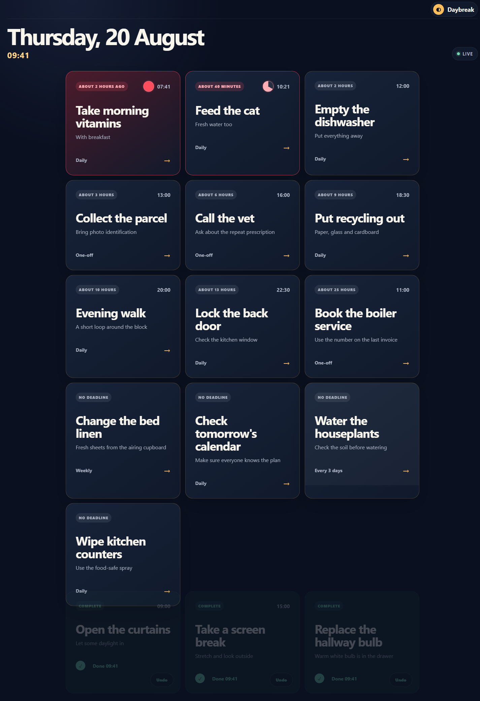
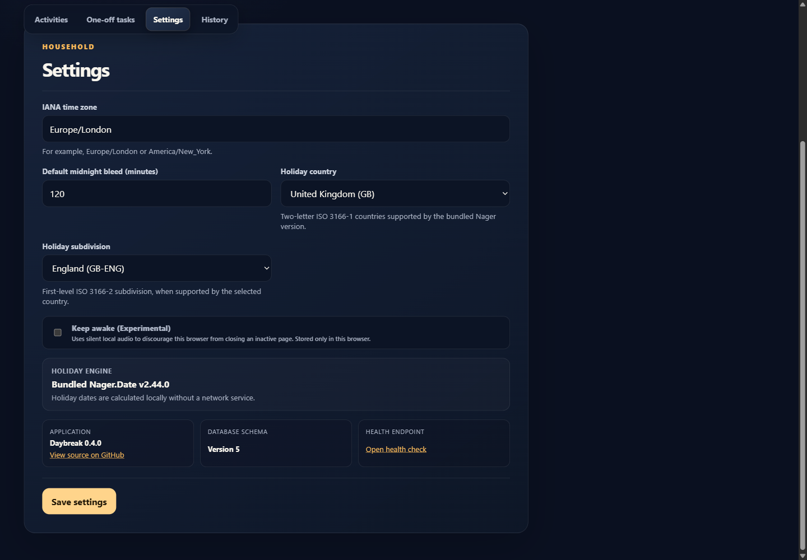
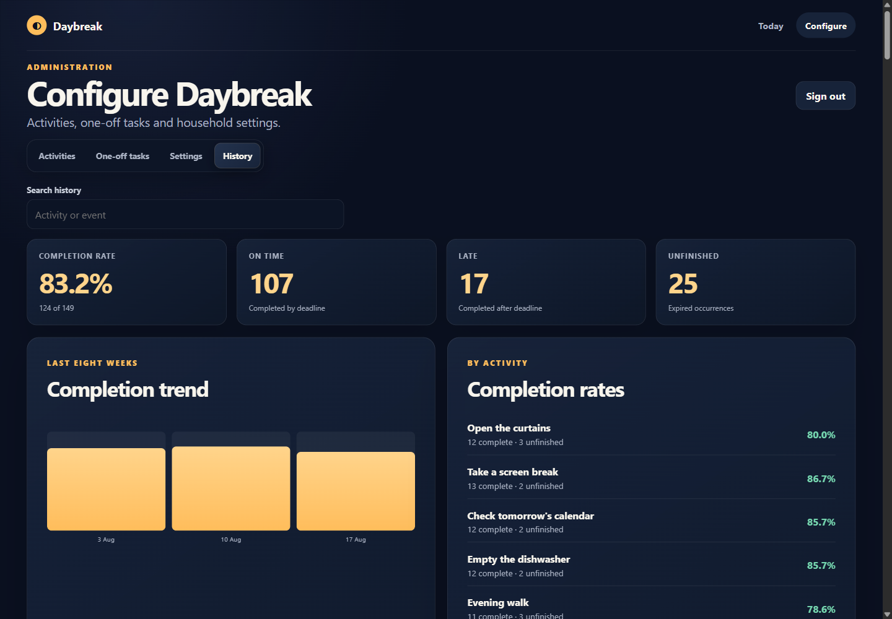

# Daybreak

Daybreak is a self-hosted household dashboard for recurring activities and one-off tasks. Open it in a web browser, select a large activity button when something is done, and every other open dashboard updates immediately.

> Daybreak is under active development. Build the image from source until the first tagged release is published.

## Screenshots

[](docs/images/dashboard.png)

| Activity configuration | History and analytics |
| --- | --- |
| [](docs/images/configuration.png) | [](docs/images/history.png) |

## What it does

- Generates today's board from daily, weekday, interval, and monthly schedules.
- Adds dated one-off tasks alongside recurring activities.
- Sorts unfinished work by overdue state and deadline.
- Provides optional due-soon and overdue pulsing, with a static reduced-motion alternative.
- Keeps near-midnight work available during a configurable bleed window.
- Expires unfinished occurrences into history instead of creating a backlog.
- Synchronizes completion, undo, expiry, rollover, and configuration changes across open browser sessions.
- Offers an experimental, per-browser keep-awake preference using locally generated silent audio.
- Adjusts schedules around holidays calculated by a vendored, fully offline Nager.Date provider.
- Supports explicit holiday moves such as “Monday holiday → previous Saturday,” with plain-English records and concrete examples.
- Simulates show-early, urgency, deadlines, recurrence overlap, and midnight bleed across a three-day administration timeline.
- Reports completion rate, on-time/late/unfinished results, weekly trends, and per-activity summaries.
- Protects configuration with one Docker-image password while leaving the dashboard URL open.
- Optionally exposes a versioned bearer-key API and a Streamable HTTP MCP server after deployment and administrator activation.

## Run with Docker Compose

Daybreak supports Linux containers only. Docker development and production builds use the same `Dockerfile`.

1. Start Daybreak:

   ```console
   docker compose up --build -d
   ```

2. Open <http://localhost:8080> for the dashboard.
3. Open <http://localhost:8080/admin> and enter `admin`.

The Compose file stores SQLite data in the named `daybreak-data` volume. Removing or replacing the container does not remove that volume.

### Docker configuration

| Setting | Required | Default | Purpose |
| --- | --- | --- | --- |
| `DAYBREAK_ADMIN_PASSWORD` | No | `admin` | Administrator password. Override the supplied value at runtime if desired. |
| `ConnectionStrings__Daybreak` | No | `Data Source=/data/daybreak.db` | SQLite connection string. |
| `Daybreak__SeedDemoData` | No | `false` | Seeds neutral demonstration activities into an empty database. |
| `Daybreak__DataProtectionKeysPath` | No | `/data/keys` in Docker | Persists administrator cookie-signing keys across container restarts. |
| `Daybreak__EnableApi` | No | `false` | Reveals API controls in administration; it does not activate the API by itself. |
| `Daybreak__EnableMcp` | No | `false` | Reveals MCP controls in administration; it does not activate MCP by itself. |
| `ASPNETCORE_HTTP_PORTS` | No | `8080` | Container HTTP port. |

Daybreak serves HTTP inside the container. Use a trusted reverse proxy for TLS before exposing it outside a trusted household network. Anyone who can reach the dashboard can complete or undo activities; only configuration routes require the administrator password.

## Backup and restore

SQLite uses a persistent Docker volume. Stop writes before taking a filesystem copy:

```console
docker compose stop daybreak
docker run --rm -v daybreak_daybreak-data:/source -v "${PWD}:/backup" alpine \
  cp /source/daybreak.db /backup/daybreak-backup.db
docker compose start daybreak
```

To restore, stop Daybreak and replace `/data/daybreak.db` in the volume with a known-good backup. Retain the original file until the restored container starts and `/health` reports success.

Database migrations run automatically at startup and are forward-only. Back up the database before deploying a newer Daybreak version.

## Agent API and MCP

Automation is disabled by default and requires both deployment configuration and an administrator action:

1. Set `Daybreak__EnableApi=true` and, when MCP is wanted, `Daybreak__EnableMcp=true` in the container configuration.
2. Restart Daybreak, sign in to configuration, and open **Settings**.
3. Generate an API key, copy it immediately, select **Enable API**, and save settings.
4. To use MCP, optionally generate and copy an MCP key, select **Enable MCP**, and save settings.

The API base URL is `/api/v1`. API clients send `Authorization: Bearer <api-key>`. It provides the authoritative board, occurrence completion and undo, activities, one-off tasks, settings, schedule preview, and history endpoints.

The MCP Streamable HTTP URL is `/mcp`. It exposes corresponding narrowly named tools. MCP depends on enabled API access and an active API key. Its own key is optional: if no MCP key exists, an enabled MCP endpoint accepts unauthenticated clients that can reach it. Administration displays a warning for that trusted-network-only mode.

Generating a replacement key immediately revokes the previous key. Plaintext keys are displayed only when generated; Daybreak stores one-way hashes and non-secret suffixes. Endpoint links never contain credentials.

See [API and MCP automation](docs/automation.md) for endpoint, tool, client-configuration, concurrency, and rotation details.

## Security and privacy

- The dashboard intentionally has no authentication in the MVP.
- Daybreak intentionally supplies the administrator password `admin`. This is a convenience control for a low-security household product, not a strong security boundary; change the committed defaults or override `DAYBREAK_ADMIN_PASSWORD` if desired.
- Administration uses a rate-limited, antiforgery-protected login form and an HTTP-only, same-site cookie.
- Password comparison is constant-time; the password itself is not stored in SQLite.
- Changing the configured password invalidates existing administrator sessions.
- Activity titles and history stay in the self-hosted SQLite database.
- API and MCP are unavailable until their container flags and administration checkboxes are both enabled. Do not expose unauthenticated MCP beyond a trusted network.
- Automation access records credential suffixes and request outcomes without recording keys or household content.
- No telemetry, email, web push, browser notification, or mandatory cloud account is used.
- Holiday dates are calculated locally from the vendored Nager.Date source; Daybreak does not contact a holiday API.

Report security concerns privately to the repository owner rather than opening a public issue containing sensitive details.

## License

Daybreak is licensed under the [MIT License](LICENSE). Direct dependencies use MIT or Apache-2.0 licenses; see [THIRD-PARTY-NOTICES.md](THIRD-PARTY-NOTICES.md).
